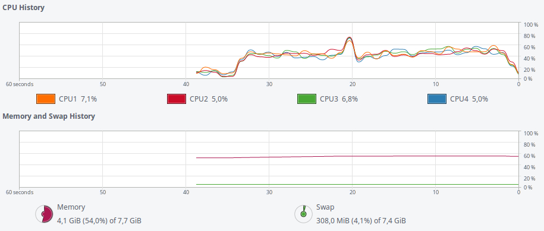

# Projekt na egzamin - Marek Strzała


Informacje o komputerze na którym były wykonywane obliczenia:

| Nazwa                 | Wartosć    |
|-----------------------|------------|
| System operacyjny     | Linux Mint 18.1 x86_64 |
| Procesor              | Intel i5-3210M @ 3.1GHz |
| Ilość rdzeni          | 4 |
| Pamięć                | 8GiB SODIMM DDR3 Synchronous 1600 MHz |
| Dysk                  | HGST 7200 RPM 750 GB HDD |
| Baza danych           | MongoDB 3.4

###Dane

[Global Terrorism Database- Full Data File, June 2016 Release](https://www.kaggle.com/START-UMD/gtd).

[Plik w formacie CSV spakowany do ZIP](https://www.kaggle.com/START-UMD/gtd/downloads/globalterrorismdb_0616dist.csv.zip).

Rozmiar bazy: 133 MB.
Liczba rekordów: 156 772.

### Przykładowy rekord
```json
{
	"_id" : ObjectId("591ea3d5043ea5be6ffacb0d"),
	"eventid" : NumberLong("200701010003"),
	"iyear" : 2007,
	"imonth" : 1,
	"iday" : 1,
	"approxdate" : "",
	"extended" : 0,
	"resolution" : "",
	"country" : 186,
	"country_txt" : "Sri Lanka",
	"region" : 6,
	"region_txt" : "South Asia",
	"provstate" : "Northern",
	"city" : "Jaffna",
	"latitude" : 9.66123,
	"longitude" : 80.02558,
	"specificity" : 1,
	"vicinity" : 0,
	"location" : "",
	"summary" : "01/1/2007: The Liberation Tigers of Tamil Ealam (LTTE), targeted a military vehicle with a claymore mine, killing one Sri Lankan soldier and wounding four in Navalady, Sri Lanka.",
	"crit1" : 1,
	"crit2" : 1,
	"crit3" : 0,
	"doubtterr" : 1,
	"alternative" : 1,
	"alternative_txt" : "Insurgency/Guerilla Action",
	"multiple" : 0,
	"success" : 1,
	"suicide" : 0,
	"attacktype1" : 3,
	"attacktype1_txt" : "Bombing/Explosion",
	"attacktype2" : "",
	"attacktype2_txt" : ".",
	"attacktype3" : "",
	"attacktype3_txt" : ".",
	"targtype1" : 4,
	"targtype1_txt" : "Military",
	"targsubtype1" : 35,
	"targsubtype1_txt" : "Military Transportation/Vehicle (excluding convoys)",
	"corp1" : "Sri Lanka Security Forces",
	"target1" : "Military Vehicle",
	"natlty1" : 186,
	"natlty1_txt" : "Sri Lanka",
	"targtype2" : "",
	"targtype2_txt" : ".",
	"targsubtype2" : "",
	"targsubtype2_txt" : ".",
	"corp2" : "",
	"target2" : "",
	"natlty2" : "",
	"natlty2_txt" : ".",
	"targtype3" : "",
	"targtype3_txt" : ".",
	"targsubtype3" : "",
	"targsubtype3_txt" : ".",
	"corp3" : "",
	"target3" : "",
	"natlty3" : "",
	"natlty3_txt" : ".",
	"gname" : "Liberation Tigers of Tamil Eelam (LTTE)",
	"gsubname" : "",
	"gname2" : "",
	"gsubname2" : "",
	"gname3" : "",
	"ingroup" : 457,
	"ingroup2" : "",
	"ingroup3" : "",
	"gsubname3" : "",
	"motive" : "Unknown",
	"guncertain1" : 0,
	"guncertain2" : "",
	"guncertain3" : "",
	"nperps" : "",
	"nperpcap" : 0,
	"claimed" : -9,
	"claimmode" : "",
	"claimmode_txt" : ".",
	"claim2" : "",
	"claimmode2" : "",
	"claimmode2_txt" : ".",
	"claim3" : "",
	"claimmode3" : "",
	"claimmode3_txt" : ".",
	"compclaim" : -9,
	"weaptype1" : 6,
	"weaptype1_txt" : "Explosives/Bombs/Dynamite",
	"weapsubtype1" : 8,
	"weapsubtype1_txt" : "Land Mine",
	"weaptype2" : "",
	"weaptype2_txt" : ".",
	"weapsubtype2" : "",
	"weapsubtype2_txt" : ".",
	"weaptype3" : "",
	"weaptype3_txt" : ".",
	"weapsubtype3" : "",
	"weapsubtype3_txt" : ".",
	"weaptype4" : "",
	"weaptype4_txt" : ".",
	"weapsubtype4" : "",
	"weapsubtype4_txt" : ".",
	"weapdetail" : "Claymore mines",
	"nkill" : 1,
	"nkillus" : 0,
	"nkillter" : 0,
	"nwound" : 4,
	"nwoundus" : 0,
	"nwoundte" : 0,
	"property" : 1,
	"propextent" : 3,
	"propextent_txt" : "Minor (likely < $1 million)",
	"propvalue" : "",
	"propcomment" : "",
	"ishostkid" : 0,
	"nhostkid" : "",
	"nhostkidus" : "",
	"nhours" : "",
	"ndays" : "",
	"divert" : "",
	"kidhijcountry" : "",
	"ransom" : "",
	"ransomamt" : "",
	"ransomamtus" : "",
	"ransompaid" : "",
	"ransompaidus" : "",
	"ransomnote" : "",
	"hostkidoutcome" : "",
	"hostkidoutcome_txt" : ".",
	"nreleased" : "",
	"addnotes" : "",
	"scite1" : "\"Sri Lankan Officials Say At least Eight Killed min Fresh Violence,\" Hong Kong AFP, January 1, 2007.",
	"scite2" : "\"Ten Killed in Sri Lanka Violence,\" Cairo Mena, January 1, 2007.",
	"scite3" : "",
	"dbsource" : "CETIS",
	"INT_LOG" : 0,
	"INT_IDEO" : 0,
	"INT_MISC" : 0,
	"INT_ANY" : 0,
	"related" : ""
}
```

### Znaczenie kolumn

Dokładny opis wszystkich kolumn i założeń znajduję się w pliku [columns_meaning.pdf](columns_meaning.pdf) .
W tym miejscu, ze względu na obszernosć opracowanych danych, przedstawione zostaną jedynie najważniejsze (lub  posiadające najmniej samoopisujące nazwy) kolumny z punktu widzenia stworzonych agregacji.

| Kolumna                 | Opis    |
|-----------------------|------------|
| iyear     | rok zdarzenia |
| country              | kraj zdarzenia |
| region         | część świata |
| city                | miasto lub miejscowość |
| attacktype1                  | typ ataku |
| success          | czy atak się powiódł |
| suicide | czy był to atak samobójczy |
| weaptype1| rodzaj wykorzystanej broni |
| targtype1 | rodzaj celu zamachu |
| natlty1 | narodowość celu |
| gname | nazwa organizacji terrorystycznej |
| nperps | liczba terrorystów biorących udział w zamachu |
| nperpcap | liczba ujętych terrorystów |
| claimed | czy jakaś organizacja się przyznała do ataku |
| nkill | liczba ofiar |
| nwound | liczb rannych |
| property | czy wystąpiła utrata mienia |
| propextent | wartość utraconego mienia |
| ishostkid | czy byli porwani lub zakładnicy |
| ndays | ile dni przetrzymywano porwanych / zakładników |
| ransom | czy żądano okupu |
| ransomamt | jakiej wysokości okupu żądano |

### Import danych

```shell
mongoimport --db nosql -c terrorism --type csv --headerline --file globalterrorismdb_0616dist.csv
```

Średni czas z pięciu importów: 28,740s.

Użycie zasobów:  

### Agregacje

Znajdują się w pliku [Aggregates.pdf](aggregates.pdf).
